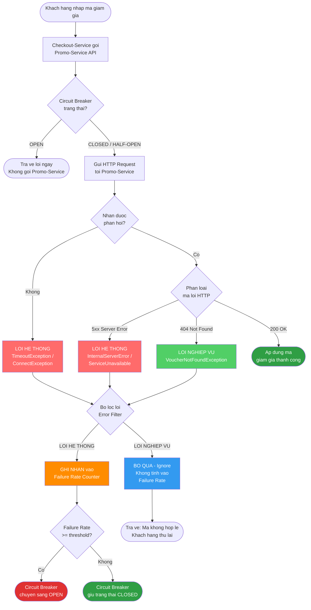

# BÀI TẬP 4: LỌC LỖI THÔNG MINH - ĐỪNG NGẮT MẠCH OAN UỔNG

## 1. Bối Cảnh Nghiệp Vụ

| Thành phần | Vai trò |
|---|---|
| **Checkout-Service** | Gọi sang Promo-Service để kiểm tra mã giảm giá |
| **Promo-Service** | Trả về `VoucherNotFoundException` (HTTP 404) khi mã không tồn tại |
| **Circuit Breaker** | Lầm tưởng 404 là lỗi hệ thống → mở mạch (OPEN) → chặn cả mã hợp lệ |

---

## Phần 1 – Lưu Đồ Thuật Toán Phân Biệt Lỗi

### Sơ đồ tổng quan luồng gọi Promo-Service



### Bảng phân loại lỗi chi tiết

| Loại Lỗi | Exception / HTTP Code | Nguyên nhân | Hành động Circuit Breaker |
|---|---|---|---|
| **Lỗi hệ thống** | `ConnectException` | Promo-Service không khởi động | **GHI NHẬN** vào failure rate |
| **Lỗi hệ thống** | `TimeoutException` | Promo-Service quá tải, chậm phản hồi | **GHI NHẬN** vào failure rate |
| **Lỗi hệ thống** | `SocketException` | Mất kết nối mạng | **GHI NHẬN** vào failure rate |
| **Lỗi hệ thống** | HTTP `500`, `503` | Lỗi nội bộ server | **GHI NHẬN** vào failure rate |
| **Lỗi nghiệp vụ** | `VoucherNotFoundException` | Khách nhập sai mã | **BỎ QUA** - không tính |
| **Lỗi nghiệp vụ** | HTTP `404 Not Found` | Mã không tồn tại trong DB | **BỎ QUA** - không tính |
| **Lỗi nghiệp vụ** | `VoucherExpiredException` | Mã đã hết hạn | **BỎ QUA** - không tính |

---

## Phần 2 – Cấu Hình application.yml

### Cấu trúc dự án

```
checkout-service/
├── src/main/
│   ├── java/com/example/checkout/
│   │   ├── exception/
│   │   │   └── VoucherNotFoundException.java
│   │   ├── config/
│   │   │   └── PromoErrorDecoder.java
│   │   └── service/
│   │       └── CheckoutService.java
│   └── resources/
│       └── application.yml
```

### Tạo Custom Exception

```java
// VoucherNotFoundException.java
package com.example.checkout.exception;

/**
 * Lỗi nghiệp vụ: Mã giảm giá không tồn tại.
 * Sẽ được Circuit Breaker BỎ QUA, không tính vào failure rate.
 */
public class VoucherNotFoundException extends RuntimeException {
    private final String voucherCode;

    public VoucherNotFoundException(String voucherCode) {
        super("Mã giảm giá không hợp lệ hoặc không tồn tại: " + voucherCode);
        this.voucherCode = voucherCode;
    }

    public String getVoucherCode() {
        return voucherCode;
    }
}
```

### Feign Error Decoder (Chuyển HTTP 404 → Business Exception)

```java
// PromoErrorDecoder.java
package com.example.checkout.config;

import com.example.checkout.exception.VoucherNotFoundException;
import feign.Response;
import feign.codec.ErrorDecoder;

public class PromoErrorDecoder implements ErrorDecoder {

    @Override
    public Exception decode(String methodKey, Response response) {
        if (response.status() == 404) {
            // Chuyển HTTP 404 thành lỗi nghiệp vụ
            // Circuit Breaker sẽ IGNORE exception này
            return new VoucherNotFoundException("UNKNOWN");
        }
        // Các lỗi khác (500, 503...) dùng decoder mặc định
        // Circuit Breaker sẽ RECORD exception này
        return new Default().decode(methodKey, response);
    }
}
```

### File application.yml (Cấu hình Circuit Breaker)

```yaml
# application.yml - Checkout Service
spring:
  application:
    name: checkout-service

  cloud:
    openfeign:
      client:
        config:
          promoClient:
            errorDecoder: com.example.checkout.config.PromoErrorDecoder

# ============================================================
# RESILIENCE4J - CẤU HÌNH CIRCUIT BREAKER
# ============================================================
resilience4j:
  circuitbreaker:
    instances:
      promoClient:                          # Khớp với @FeignClient(name)

        # --- CỬA SỔ TRƯỢT ---
        slidingWindowType: COUNT_BASED      # Đếm theo số lượng request
        slidingWindowSize: 20              # Xét 20 request gần nhất

        # --- NGƯỠNG MỞ MẠCH ---
        failureRateThreshold: 50           # Mở mạch khi >= 50% là lỗi hệ thống
        slowCallRateThreshold: 80
        slowCallDurationThreshold: 3000    # Ngưỡng "chậm" = 3 giây

        # --- THỜI GIAN CHỜ Ở TRẠNG THÁI OPEN ---
        waitDurationInOpenState: 30s

        # --- CẤU HÌNH HALF-OPEN ---
        permittedNumberOfCallsInHalfOpenState: 5

        # --- MINIMUM REQUESTS ĐỂ TÍNH FAILURE RATE ---
        minimumNumberOfCalls: 10

        # ============================================================
        # BỘ LỌC LỖI - PHẦN QUAN TRỌNG NHẤT
        # ============================================================

        # CHIẾN LƯỢC 1: ignoreExceptions (Khuyến nghị)
        # Liệt kê các exception LỖI NGHIỆP VỤ cần BỎ QUA
        # Circuit Breaker sẽ KHÔNG tính chúng vào failure rate
        ignoreExceptions:
          - com.example.checkout.exception.VoucherNotFoundException
          # Thêm các lỗi nghiệp vụ khác nếu có:
          # - com.example.checkout.exception.VoucherExpiredException
          # - com.example.checkout.exception.VoucherAlreadyUsedException

        # CHIẾN LƯỢC 2: recordExceptions (Thay thế hoặc kết hợp)
        # Chỉ những exception này mới tính vào failure rate
        recordExceptions:
          - java.io.IOException
          - java.net.ConnectException
          - java.util.concurrent.TimeoutException
          - java.net.SocketTimeoutException
          - feign.RetryableException

  # --- CẤU HÌNH RETRY ---
  retry:
    instances:
      promoClient:
        maxAttempts: 3
        waitDuration: 500ms
        # Chỉ retry lỗi hệ thống, KHÔNG retry lỗi nghiệp vụ
        retryExceptions:
          - java.net.ConnectException
          - java.util.concurrent.TimeoutException
        ignoreExceptions:
          - com.example.checkout.exception.VoucherNotFoundException

  # --- TIMEOUT ---
  timelimiter:
    instances:
      promoClient:
        timeoutDuration: 2s

# ============================================================
# ACTUATOR - THEO DÕI CIRCUIT BREAKER
# ============================================================
management:
  endpoints:
    web:
      exposure:
        include: health,circuitbreakers,metrics
  health:
    circuitbreakers:
      enabled: true
  endpoint:
    health:
      show-details: always

promo:
  service:
    url: http://promo-service:8082
```

### Sử dụng trong Service Layer

```java
// CheckoutService.java
@Service
@Slf4j
@RequiredArgsConstructor
public class CheckoutService {

    private final PromoServiceClient promoServiceClient;

    @CircuitBreaker(name = "promoClient", fallbackMethod = "applyVoucherFallback")
    @Retry(name = "promoClient")
    public VoucherResponse applyVoucher(String voucherCode, String customerId) {
        log.info("Kiểm tra mã: {} cho khách: {}", voucherCode, customerId);
        return promoServiceClient.validateVoucher(voucherCode);
    }

    /**
     * Fallback chỉ kích hoạt khi Circuit Breaker OPEN (lỗi hệ thống)
     * KHÔNG được gọi khi VoucherNotFoundException (đã bị ignore)
     */
    public VoucherResponse applyVoucherFallback(
            String voucherCode, String customerId, Exception ex) {
        log.warn("Circuit Breaker OPEN! Fallback cho mã: {}", voucherCode);
        return VoucherResponse.builder()
                .valid(false)
                .message("Không thể kiểm tra mã lúc này. Vui lòng thử lại sau.")
                .build();
    }
}
```

---

## Tóm Tắt Giải Pháp

```
┌─────────────────────────────────────────────────────────────────┐
│                    BỘ LỌC LỖI CIRCUIT BREAKER                   │
├──────────────────────────┬──────────────────────────────────────┤
│   LỖI HỆ THỐNG           │   LỖI NGHIỆP VỤ                     │
│   (recordExceptions)      │   (ignoreExceptions)                 │
├──────────────────────────┼──────────────────────────────────────┤
│  ConnectException        │  VoucherNotFoundException            │
│  TimeoutException        │  VoucherExpiredException             │
│  SocketException         │  VoucherAlreadyUsedException         │
│  HTTP 500, 503           │  HTTP 404 (chuyển thành exception)   │
├──────────────────────────┼──────────────────────────────────────┤
│ → TÍNH vào failure rate  │ → BỎ QUA, không tính                │
│ → Có thể mở mạch OPEN   │ → Circuit Breaker vẫn CLOSED         │
└──────────────────────────┴──────────────────────────────────────┘
```

> **Kết quả:** Dù ngày Sale có hàng nghìn khách nhập sai mã, Circuit Breaker vẫn ổn định.
> Promo-Service chỉ thực sự bị "ngắt mạch" khi hệ thống gặp vấn đề kỹ thuật thực sự.
